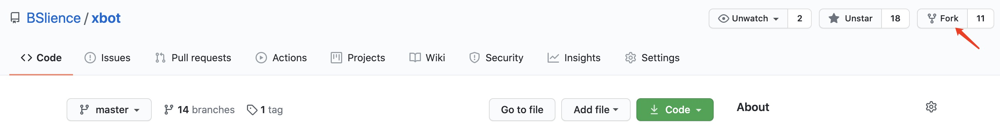
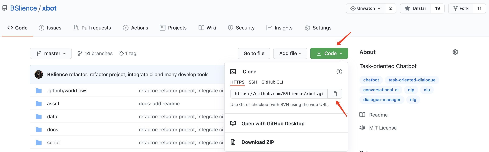
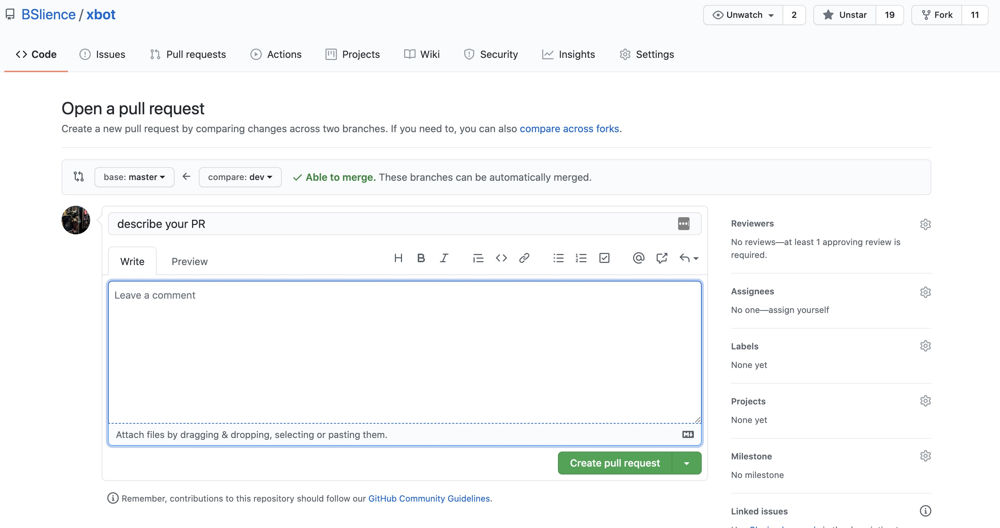

[中文](CONTRIBUTING.md)

## How to open a PR and contribute code to xbot Open Source

#### 1. Forking the xbot Repository

Head to xbot repository and click ‘Fork’. Forking a repository creates you a copy of the project which you can edit and use to propose changes to the original project.



Once you fork it, a copy of the xbot repository will appear inside your GitHub repository list.

#### 2. Cloning the Forked Repository Locally

To make changes to your copy of the xbot repository, clone the repository on your local machine. To do that, run the following command in your terminal:

```
git clone https://github.com/your_github_username/xbot.git
```

The link to the repository can be found after clicking Clone or download button as shown in the image below:



Note: this assumes you have git installed on your local machine. If not, check out the [following guide](https://git-scm.com/book/en/v2/Getting-Started-Installing-Git) to learn how to install it.

#### 3. Update your Forked Repository

Before you make any changes to your cloned repository, make sure you have the latest version of the original xbot repository. To do that, run the following commands in your terminal:

```
cd xbot
git remote add upstream https://github.com/BSlience/xbot.git
git pull upstream dev
```

This will update the local copy of the xbot repository to the latest version.

#### 4. Implement your code contribution

At this point, you are good to make changes to the files in the local directory of your project.

Alternatively, you can create a new branch which will contain the implementation of your contribution. To do that, run:

```
git checkout -b name-of-your-new-branch
```

#### 5. Push changes to your forked repository on GitHub

Once you are happy with the changes you made in the local files, push them to the forked repository on GitHub. To do that, run the following commands:

```
git add .
git commit -m ‘fixed a bug’
git push origin name-of-your-new-branch
```

This will create a new branch on your forked xbot repository, and now you’re ready to create a Pull Request with your proposed changes!

#### 6. Opening the Pull Request on xbot Open Source

Head to the forked repository and click on a _Compare & pull_ request button.

This will open a window where you can choose the repository and branch you would like to propose your changes to, as well as specific details of your contribution. In the top panel menu choose the following details:

- Base repository: `BSlience/xbot`
- Base branch: `dev`
- Head repository: `your-github-username/xbot`
- Head branch: `name-of-your-new-branch`



Next, make sure to update the pull request card with as many details about your contribution as possible. _Proposed changes_ section should contain the details of what has been fixed/implemented, and Status should reflect the status of your contributions. Any reasonable change (not like a typo) should include a changelog entry, a bug fix should have a test, a new feature should have documentation, etc.

If you are ready to get feedback on your contribution from the xbot team, tick the _made PR ready for code review_ and _allow edits from maintainers_ box.

Once you are happy with everything, click the _Create pull request_ button. This will create a Pull Request with your proposed changes.

#### 7. Merging your PR and the final steps of your contribution

After you create a Pull Request, a member from the xbot team will get in touch with you with the feedback on your contribution. In some cases, contributions are accepted right away, but often, you may be asked to make some edits/improvements. Don’t worry if you are asked to change something - it’s a completely normal part of software development.

If you have been requested to make changes to your contribution, head back to the local copy of your repository on your machine, implement the changes and push them to your contribution branch by repeating instructions from step 5. Your pull request will automatically be updated with the changes you pushed. Once you've implemented all of the suggested changes, tag the person who first reviewed your contribution by mentioning them in the comments of your PR to ask them to take another look.
Finally, if your contribution is accepted, the xbot team member will merge it to the xbot codebase.

#### 8. Share your contributions with the world!

Contributing to open source can take a lot of time and effort, so you should be proud of the great work you have done!
Let the world know that you have become a contributor to the xbot open source project by posting about it on your social media (make sure to tag @xbot as well). 

#### 9. Non-code contributions

Contributing doesn’t start and end with code. You can support the project by planning community events, creating tutorials, helping fellow community members find answers to their questions or translating documentation and news. Every contribution matters! 