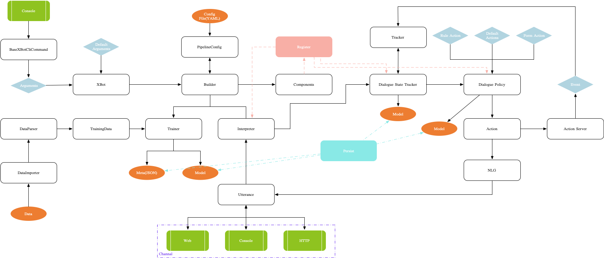

[](https://github.com/BSlience/xbot/actions?workflow=Tests)
[](https://codecov.io/gh/BSlience/xbot)
[](https://github.com/BSlience/xbot/blob/master/LICENSE)


[English](README.en_US.md)

# XBot

XBot是一个易用的智能对话系统框架，它能帮助你从0开始搭建适应你的应用场景的对话机器人。

我们的愿景是在将来为每一个人提供使用简单、功能强大的智能对话系统。欢迎你的加入:rocket: :rocket:


## 快速开始

请在终端中运行以下命令，克隆仓库：

```
git clone https://github.com/BSlience/xbot.git
```

## 整体架构


## 在哪里获得帮助

你可以在[XBot文档](https://xbot-friends.bslience.cn/)中找到可供参考的文档。


## 如何贡献

我们非常高兴收到您的贡献并将其合并到这个项目中！

想要对项目进行贡献，请执行以下步骤：

    1.提出一个关于您要使用的功能的Issue

    2.编写代码，测试和文档，并通过 `Black` 对其进行格式化

    3.使用文字描述你的贡献

有关如何贡献代码的详细说明，请查看这里的[代码贡献者指南](CONTRIBUTING.md)。

你的请求将由维护人员进行审核，若有必要的更改等问题，维护人员会与你联系。


## 许可

依据Apache许可证2.0版获得许可。 XBot Technologies GmbH版权所有2020。


[许可副本](https://github.com/BSlience/xbot/blob/master/LICENSE)。