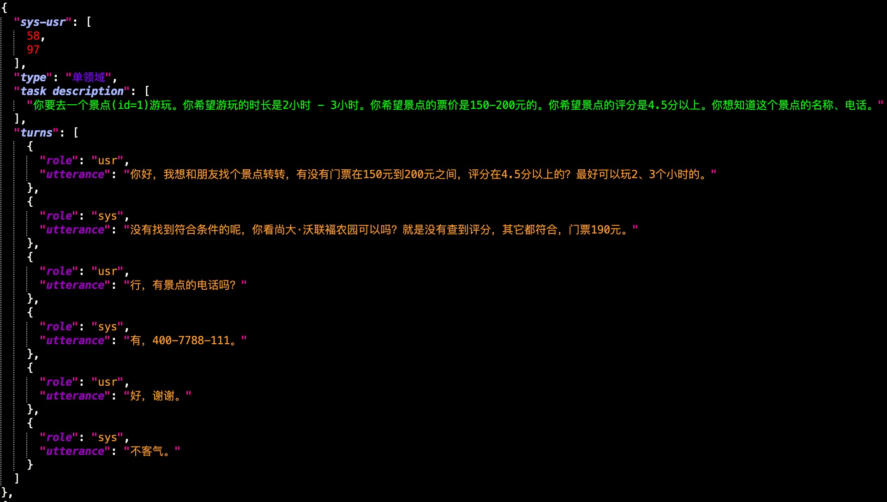

[](https://github.com/BSlience/xbot/actions?workflow=Tests)
[](https://codecov.io/gh/BSlience/xbot)
[](https://github.com/BSlience/xbot/blob/master/LICENSE)


# XBot
This is a chatbot for X.


## Quick Start
```
git clone https://github.com/BSlience/xbot.git
```

## How to contribute
## How to contribute
We are very happy to receive and merge your contributions into this repository! 

To contribute via pull request, follow these steps:

1. Create an issue describing the feature you want to work on 
2. Write your code, tests and documentation, and format them with ``black``
3. Create a pull request describing your changes

For more detailed instructions on how to contribute code, check out these [code contributor guidelines](CONTRIBUTING.md).

Your pull request will be reviewed by a maintainer, who will get
back to you about any necessary changes or questions. 

### NLU
```bash
cd xbot

# intent classification predict
python xbot/nlu/intent/intent_with_bert.py
# intent classification train
python script/nlu/intent/nlu_intent_train.py

# slot extraction predict
cd xbot/ && python xbot/slot/slot_with_bert.py
# slot extraction train
python script/nlu/slot/nlu_slot_train.py

# nlu-joint predict
cd xbot/ && python xbot/joint/joint_with_bert.py
# nlu-joint train
python script/nlu/joint/nlu_joint_train.py
```

### DST

### DP

### NLG

## Documentation


## Architecture


## Dataset
[CrossWOZ](https://arxiv.org/pdf/2002.11893.pdf)


## Project Index
```
- xbot
    - asset(素材文件)
    - data(数据集和数据处理相关文件)
        - crosswoz(CrossWOZ数据集)
            - data-process(数据处理脚本)
            - database(数据库文件)
            - raw(数据集源文件)
                - test.json.zip
                - train.json.zip
                - val.json.zip
            - 各模块中间数据文件
    - script(训练和测试脚本)
        - nlu
            - intent
            - slot
        - dm
            - dst
            - dp
        - nlg
    - test(单元测试)
    - xbot(xbot机器人项目源码，该部分代码不包含模型train和test代码，只包含模型和参数load代码)
        - data(对话机器人对话过程中数据处理模块)
        - nlu(自然语言理解模块)
            - intent(意图识别模块)
            - slot(词槽抽取模块)
            - joint(联合抽取模块)
        - dm(对话管理模块)
            - dst(对话状态跟踪模块)
            - dp(对话对策处理模块)
        - nlg(对话生成模块)
        - util(工具模块)
        - hippocampus(知识库模块)
    - exception.py(异常类定义代码)
    - chatbot.py(对话机器人主体代码)
    - pipeline.py(管道处理代码)
    - response.py(对话回复代码)
    - requirements.txt(项目中使用的包明和版本号)
    - tox.ini
```
