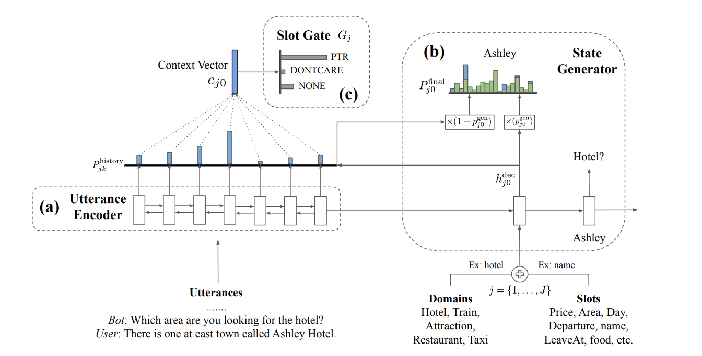

# Trade
This is the PyTorch implementation of the paper:
[Transferable Multi-Domain State Generator for Task-Oriented Dialogue Systems](https://arxiv.org/abs/1905.08743).
Code adapted from [here](https://github.com/thu-coai/CrossWOZ/tree/master/convlab2/dst/trade)


## Example Usage
To train a model from scratch, run following command in this directory:
```bash
$ python train.py
```
Note: default hidden size is 100, and embedding size is the same as hidden size. So if you want to load a pretrained
word embedding to training, because the embedding size of the default [pretrained word embedding](https://pan.baidu.com/s/1ZKePwxwsDdzNrfkc6WKdGQ)
set here is 300, you should set hidden size to 300, meanwhile setting `load_embedding` to 1(true). The arguments mentioned above all are in the directory: xbot/xbot/configs/dst/trade/.

Try to tune these hyper-parameters according to your own ideas, such as: No longer using hidden size as embedding size,
then when you want use pretrained word embedding to train a model, you don't need to adjust hidden size.
